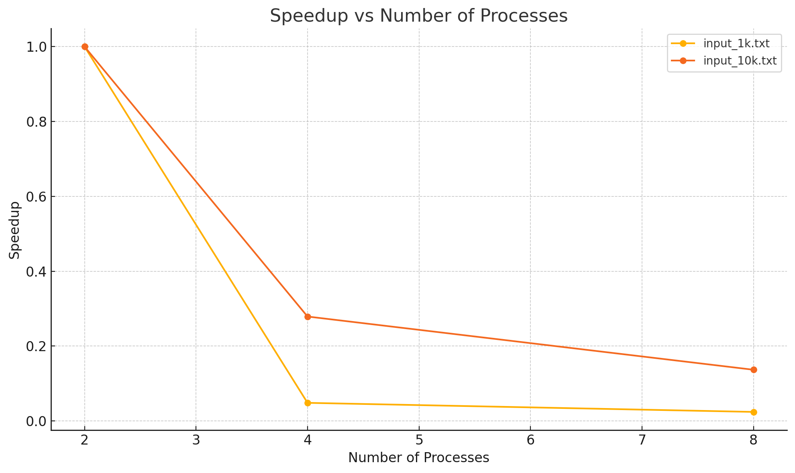

# poa_final
Кейсы:
Hello world
This is a test
World of parallel computing
yes "parallel computing is cool" | head -n 1000 > input_1k.txt
yes "mpi and openmp together are powerful" | head -n 10000 > input_10k.txt
echo "hugeword1 hugeword1 hugeword1 ..." (повторить 1000 раз в одной строке)
root@LAPTOP-A1PJG8R1:/mnt/c/Users/Дильназ/poa_final# mpirun --allow-run-as-root --oversubscribe -np 8 ./hybrid_wordcount input.txt
parallel: 1
of: 1
test: 1
a: 1
is: 1
this: 1
hello: 1
computing: 1
world: 2
Total Execution Time: 0.186123 seconds
root@LAPTOP-A1PJG8R1:/mnt/c/Users/Дильназ/poa_final# mpirun --allow-run-as-root --oversubscribe -np 8 ./hybrid_wordcount input1k.txt
Total Execution Time: 0.22011 seconds
root@LAPTOP-A1PJG8R1:/mnt/c/Users/Дильназ/poa_final# mpirun --allow-run-as-root --oversubscribe -np 8 ./hybrid_wordcount input_1k.txt
parallel: 1000
cool: 1000
computing: 1000
is: 1000
Total Execution Time: 0.228688 seconds
root@LAPTOP-A1PJG8R1:/mnt/c/Users/Дильназ/poa_final# mpirun --allow-run-as-root --oversubscribe -np 2 ./hybrid_wordcount input_1k.txt
parallel: 1000
cool: 1000
computing: 1000
is: 1000
Total Execution Time: 0.00551589 seconds
root@LAPTOP-A1PJG8R1:/mnt/c/Users/Дильназ/poa_final# mpirun --allow-run-as-root --oversubscribe -np 4 ./hybrid_wordcount input_1k.txt
parallel: 1000
cool: 1000
computing: 1000
is: 1000
Total Execution Time: 0.114108 seconds
root@LAPTOP-A1PJG8R1:/mnt/c/Users/Дильназ/poa_final# mpirun --allow-run-as-root --oversubscribe -np 4 ./hybrid_wordcount input_10k.txt
mpi: 10000
and: 10000
together: 10000
openmp: 10000
are: 10000
powerful: 10000
Total Execution Time: 0.117787 seconds
root@LAPTOP-A1PJG8R1:/mnt/c/Users/Дильназ/poa_final# mpirun --allow-run-as-root --oversubscribe -np 2 ./hybrid_wordcount input_10k.txt
mpi: 10000
and: 10000
together: 10000
openmp: 10000
are: 10000
powerful: 10000
Total Execution Time: 0.0328516 seconds
root@LAPTOP-A1PJG8R1:/mnt/c/Users/Дильназ/poa_final# mpirun --allow-run-as-root --oversubscribe -np 8 ./hybrid_wordcount input_10k.txt
mpi: 10000
and: 10000
together: 10000
openmp: 10000
are: 10000
powerful: 10000
Total Execution Time: 0.240253 seconds
root@LAPTOP-A1PJG8R1:/mnt/c/Users/Дильназ/poa_final#
# Speedup Graph

    